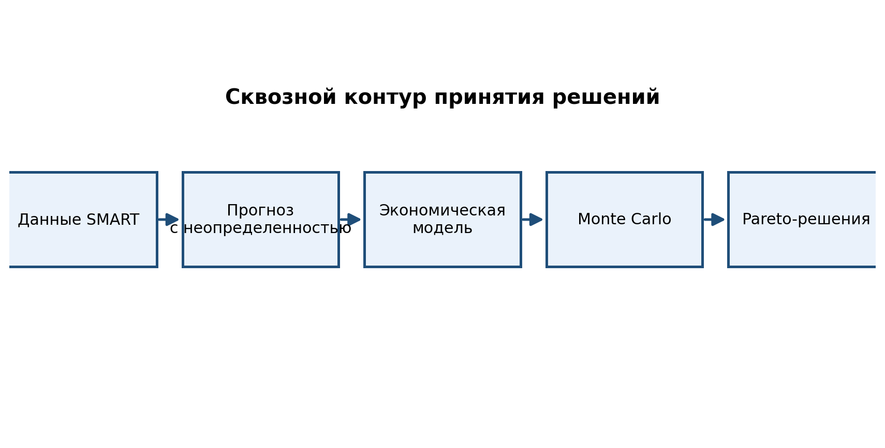

# Проблема

- Отказы внешних накопителей вызывают прямые и косвенные потери.
- Точечный прогноз недостаточен для управленческого решения.
- Нужна риск-ориентированная политика замены и закупки.
- Подход: прогноз + неопределенность + экономическая оптимизация.

