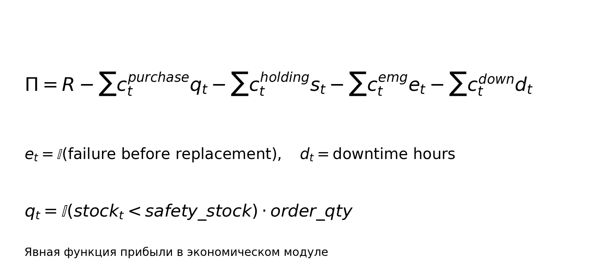

# Экономическая модель

- Прибыль учитывает закупку, хранение, аварийную замену и простой.
- Правило замены: если `p_i > tau_replace`, выполняется превентивная замена.
- Правило пополнения: при `stock < safety_stock` заказывается `order_qty`.
- Экономические параметры моделируются как случайные величины.

