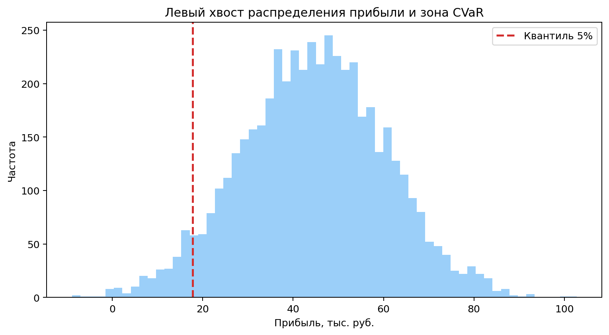

# Monte Carlo и CVaR

- Для фиксированной policy запускается множество сценариев.
- В каждом сценарии сэмплируются экономика и прогнозная неопределенность.
- Получаем выборку `samples` прибыли.
- `CVaR_alpha` — средняя прибыль в худших `alpha` долях сценариев.

