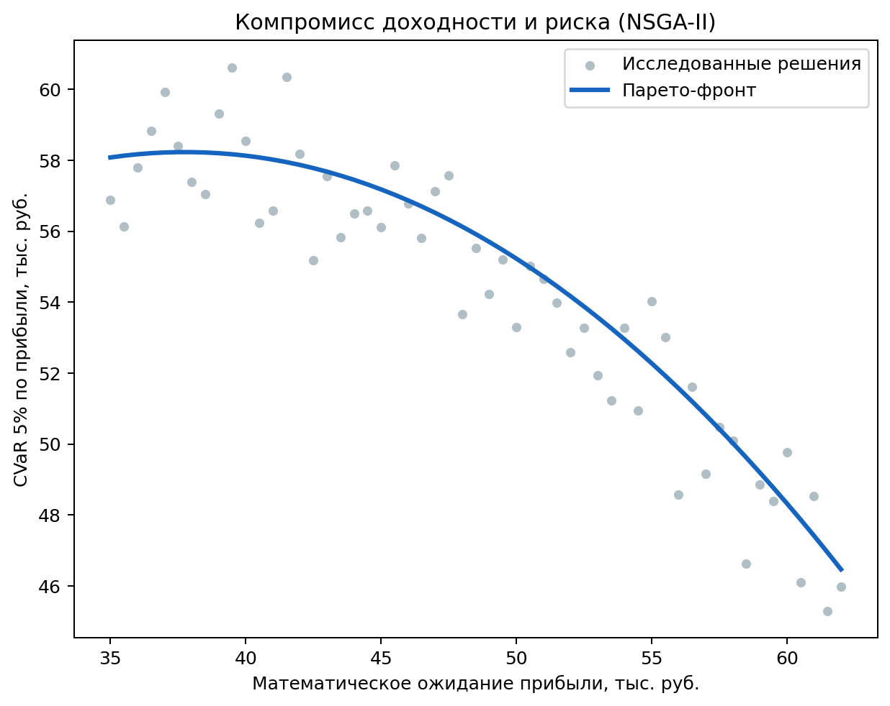

# Оптимизация

- Метод: NSGA-II (`pymoo`) для двух целевых функций.
- Результат: Pareto-front вместо единственного «лучшего» решения.
- Выбираются risk-neutral, risk-averse и compromise policy.
- Интерпретация выполняется в координатах доходность-риск.

