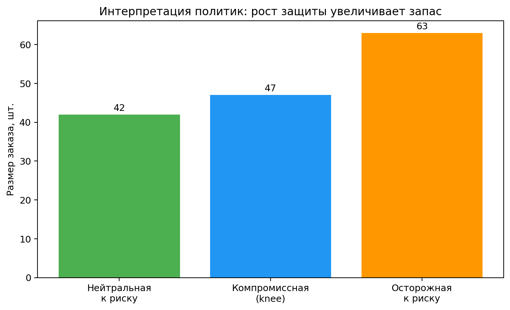

# Результаты

- Risk-averse policy системно увеличивает `order_qty`.
- Компромиссная policy балансирует среднюю прибыль и хвостовые риски.
- Научный вывод: точность прогноза и экономическая полезность различаются.
- Практический вывод: policy выбирается по риск-профилю эксплуатации.

