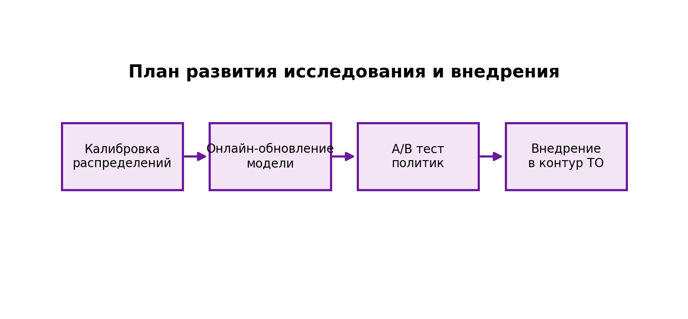

# План развития

- Моделирование прогноза стоимости дисков и инфляции (например, Prophet).
- Trade-off пассивного мониторинга и активного scrubbing (риск vs I/O overhead).
- Снижение вычислительной сложности пайплайна для SaaS-формата.
- Онлайн-обновление прогноза и адаптация policy.

