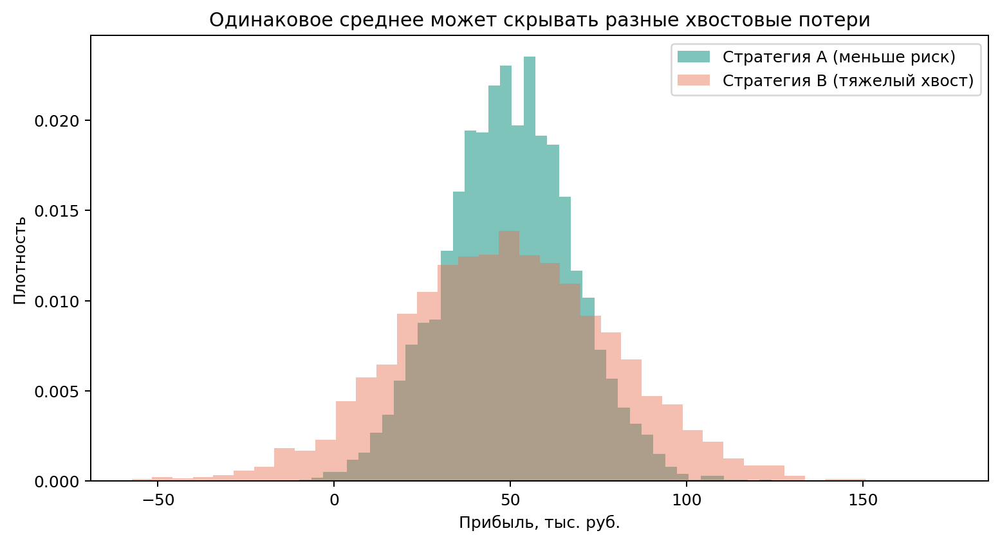

# Актуальность

- Неопределенность входов делает детерминированные policy хрупкими.
- Максимизация только среднего скрывает хвостовые убытки.
- Для эксплуатации критичны худшие сценарии.
- Поэтому критерии: `ExpectedProfit` и `CVaR_alpha`.

