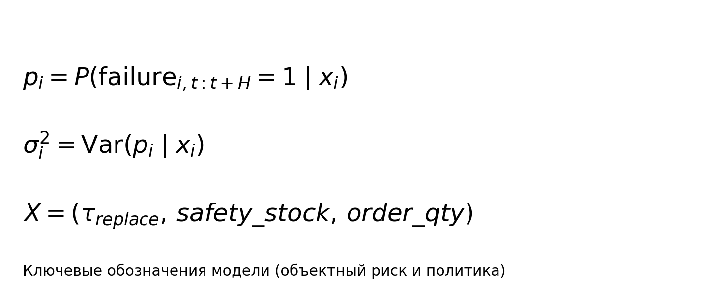

# Основные термины и определения

- `p_i` — вероятность отказа диска `i` на горизонте `H`.
- `sigma_i^2` — объектная неопределенность прогноза.
- `X=(tau_replace, safety_stock, order_qty)` — вектор policy.
- `Pi(X)` — случайная прибыль при фиксированной policy.

