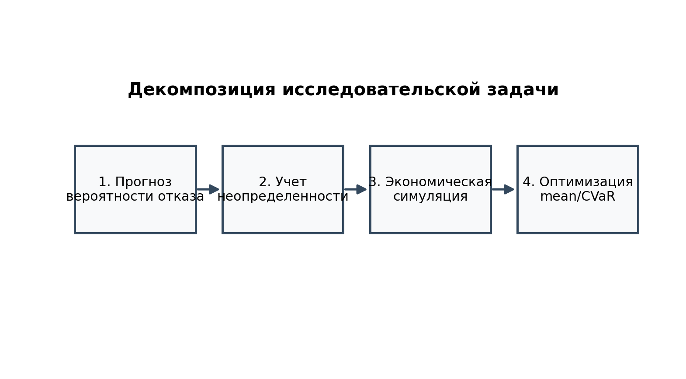

# Цель работы и задачи

- Цель: максимизировать прибыль при контроле хвостового риска.
- Задача 1: построить прогноз отказа с object-wise uncertainty.
- Задача 2: встроить прогноз в экономическую модель затрат.
- Задача 3: оптимизировать policy по двум критериям.
- Бизнес-акцент: перевод вероятностей отказа в деньги и риски простоя.

