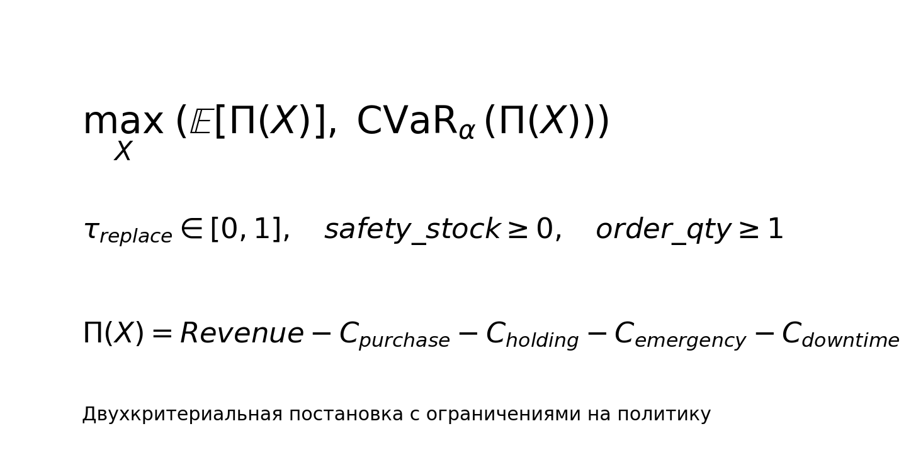

# Постановка задачи

- Решение: `X=(tau_replace, safety_stock, order_qty)`.
- Ограничения: `tau_replace in [0,1]`, `safety_stock >= 0`, `order_qty >= 1`.
- Критерии: максимизация `E[Pi(X)]` и `CVaR_alpha(Pi(X))`.
- Эквивалентно в оптимизации: `f1=-E[Pi(X)]`, `f2=-CVaR_alpha(Pi(X))`.

