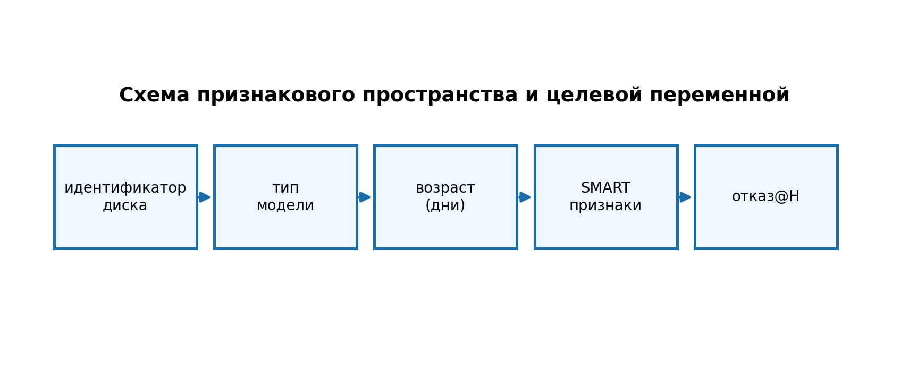

# Данные

- Единица наблюдения: `disk_id` во времени.
- Признаки: SMART, возраст, тип накопителя.
- Цель: `failure@H` (отказ в горизонте `H` дней).
- Реальных отказов в контуре МТС пока мало (< 2 лет эксплуатации), поэтому синтетика используется для валидации framework.
- Синтетика учитывает временные зависимости деградации (CTGAN/марковские переходы), а не только маргинальные распределения.
- Валидность: time-aware split и контроль утечки по `disk_id`.

