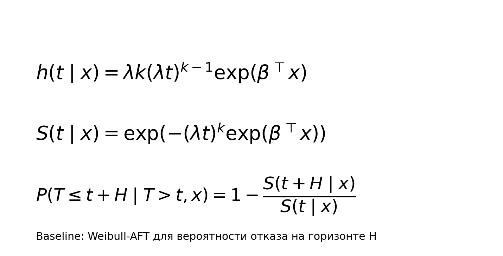

# Базовая модель

- Baseline: Weibull survival как интерпретируемый эталон.
- Оценка функции риска `h(t|x)` и выживания `S(t|x)`.
- Целевая вероятность: отказ на горизонте `H` при условии выживания до `t`.
- Назначение baseline: проверка прироста от основной модели.

