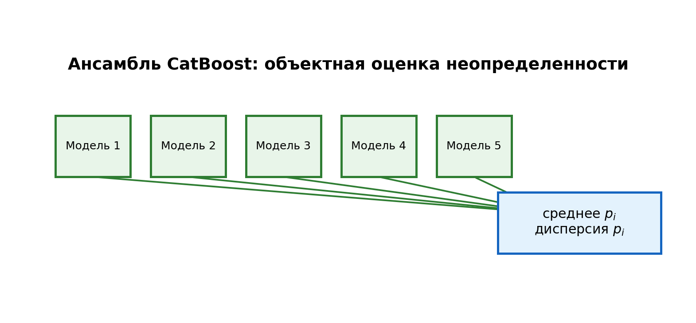

# Основная модель

- Main model: ансамбль CatBoost по bootstrap-подвыборкам.
- Для каждого объекта получаем `mean(p_i)` и `var(p_i)`.
- Object-wise uncertainty передается в decision layer.
- Это Bayesian approximation: аппроксимация байесовской логики через ансамбль, без полной BNN-постановки.

